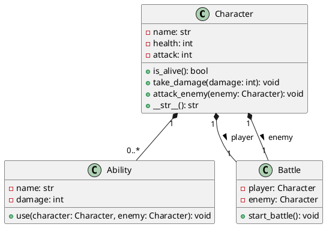

# Batalla Épica

## Descripción

"Batalla Épica" es un juego de combate por turnos donde los jugadores controlan a un héroe que lucha contra un monstruo. El juego se desarrolla en una interfaz gráfica donde se puede ver la salud de los personajes y los resultados de sus acciones durante la batalla.

## Instalación

Para jugar "Batalla Épica", necesitas tener Python y Pygame instalados. Sigue estos pasos para configurar el entorno:

1. Clona el repositorio:
   ```
   git clone https://tu-repositorio/batalla-epica.git
   cd batalla-epica
   ```

2. (Opcional) Crea y activa un entorno virtual:
   ```
   python -m venv venv
   source venv/bin/activate  # En Windows usa `venv\Scripts\activate`
   ```

3. Instala las dependencias:
   ```
   pip install pygame
   ```

## Ejecución

Para iniciar el juego, navega al directorio del proyecto y ejecuta el siguiente comando:

```
python -m game_interface.main
```

## Modelo de Clases

A continuación se presenta el diagrama del modelo de clases del juego, diseñado con PlantUML.



Este diagrama muestra las relaciones entre las clases `Character`, `Ability`, y `Battle`, indicando cómo interactúan entre ellas para simular la batalla en el juego.

## Testing

Antes de ejecutar el juego, puedes correr las pruebas unitarias para asegurarte de que todo funciona correctamente.

La librería `unittest` de Python se utiliza para escribir y ejecutar las pruebas. Para instalarla ejecuta el siguiente comando:

```
pip install unittest
```

Para ejecutar las pruebas unitarias, utiliza el siguiente comando:

```
python -m unittest discover -s tests
```

## Assets y derechos de autor

Los assets utilizados en este juego son de dominio público y se pueden encontrar en sitios como [Itch.io](https://https://itch.io/). Los créditos de los assets utilizados en este juego son los siguientes:

- **Héroe**: [Free Fantasy Knight](https://free-game-assets.itch.io/free-fantasy-knight)

### Notas

- **Diagrama de Clases**: El bloque de código PlantUML proporciona una visualización del modelo de clases. Este diagrama se puede visualizar usando herramientas que soportan PlantUML, como plugins en editores de texto o servicios online.
- **Ejecución**: La instrucción de ejecución es específica y clara, indicando cómo correr el módulo principal del juego.
- **Instrucciones de Instalación**: Estas instrucciones asumen que el jugador o desarrollador ya tiene Python instalado y le guía a través de la instalación de Pygame, que es la única dependencia externa necesaria.
